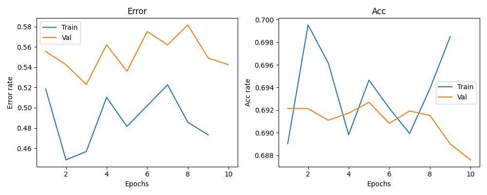
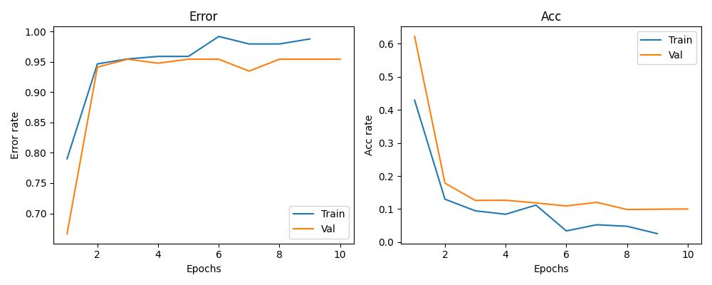
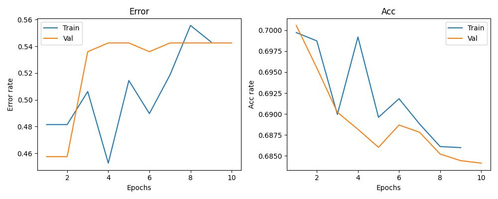
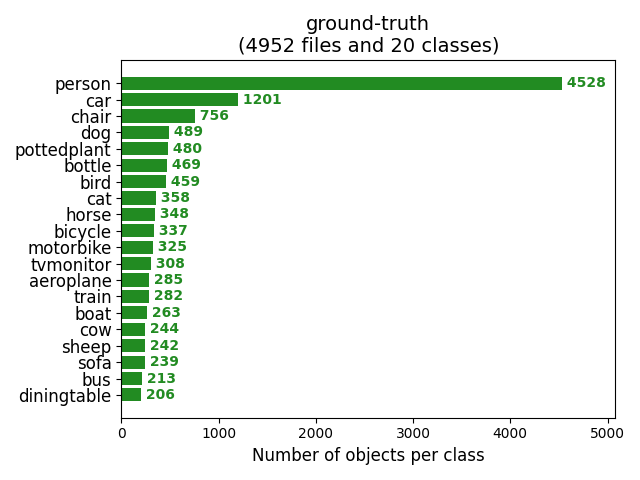
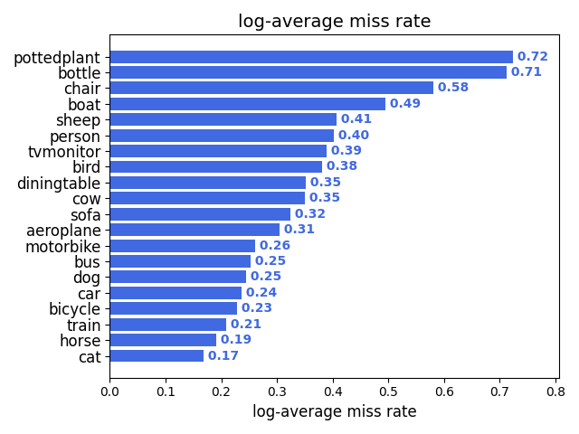
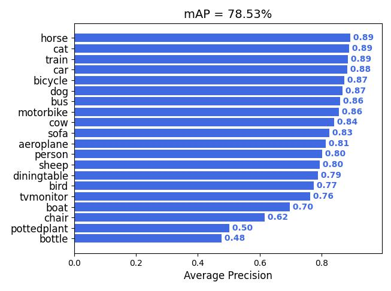
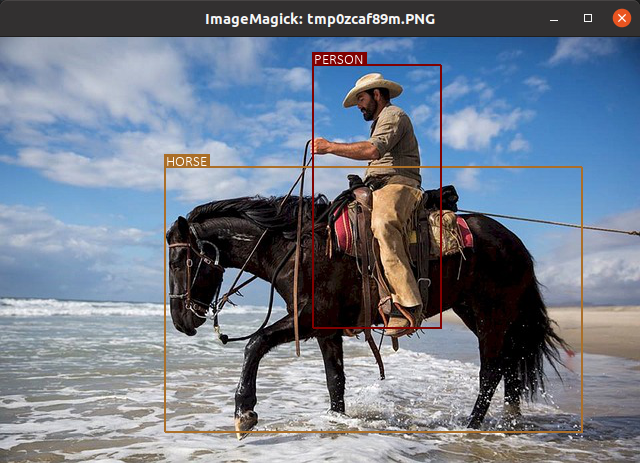
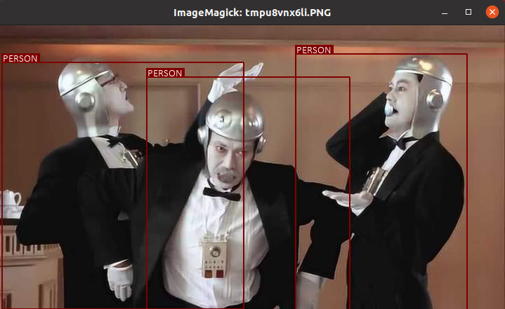

Table of Contents
=================

   * [01 Instructions for CUDA v11.3 and cuDNN 8.2 installation on Ubuntu 20.04 for PyTorch 1.11](#01-instructions-for-cuda-v113-and-cudnn-82-installation-on-ubuntu-2004-for-pytorch-111)
      * [RTX 3090 requires driver version of 515 (not 470).](#rtx-3090-requires-driver-version-of-515-not-470)
      * [CUDA v11.8 and cuDNN 8.2 installation on Ubuntu 20.04 for PyTorch](#cuda-v118-and-cudnn-82-installation-on-ubuntu-2004-for-pytorch)
         * [1. Make a virtual environment](#1-make-a-virtual-environment)
         * [2. Activate the virtual envPermalink](#2-activate-the-virtual-envpermalink)
         * [3. Check Pytorch Use CUDA and Test the Installation](#3-check-pytorch-use-cuda-and-test-the-installation)
         * [ModuleNotFoundError: No module named 'virtualenv.seed.embed.via_app_data'](#modulenotfounderror-no-module-named-virtualenvseedembedvia_app_data)
   * [02 Docker_GPU-RTX3090_Pytorch](#02-docker_gpu-rtx3090_pytorch)
      * [Nvidia Driver, CUDA, CuDNN Version選定](#nvidia-driver-cuda-cudnn-version選定)
         * [Docker Install](#docker-install)
         * [Nvidia Driver Install](#nvidia-driver-install)
         * [CUDA Install](#cuda-install)
         * [CuDNN Install](#cudnn-install)
         * [Setting up NVIDIA Container Toolkit](#setting-up-nvidia-container-toolkit)
         * [Dockerfile作成](#dockerfile作成)
         * [Docker操作](#docker操作)
         * [GPUの確認](#gpuの確認)
         * [コンテナのImages化](#コンテナのimages化)
         * [ubuntu:pytorch-gpu-base からコンテナをつくる](#ubuntupytorch-gpu-base-からコンテナをつくる)
         * [docker compose](#docker-compose)
      * [Docker stuff](#docker-stuff)
         * [Docker コンテナの起動](#docker-コンテナの起動)
         * [Docker コンテナにbashではいる](#docker-コンテナにbashではいる)
         * [Docker コンテナのImage化](#docker-コンテナのimage化)
         * [Nvidia Driver version 確認](#nvidia-driver-version-確認)
   * [03 PyTorch Deep Learning](#04-pytorch-deep-learning)
      * [1_image_classification](#1_image_classification)
         * [VGG](#vgg)
         * [weights = none](#weights--none)
         * [Fine tune (weights = models.VGG16_Weights.DEFAULT)](#fine-tune-weights--modelsvgg16_weightsdefault)
         * [Fine tune (weights = none)](#fine-tune-weights--none)
         * [Reference](#reference)
      * [2_objectdetection](#2_objectdetection)
         * [Single Shot Multibox Detector (SSD)](#single-shot-multibox-detector-ssd)
         * [Training](#training)
         * [Evaluation](#evaluation)
         * [Inference](#inference)
         * [Reference](#reference-1)
      * [3_semantic_segmentation](#3_semantic_segmentation)
         * [Reference](#reference-2)
      * [4_pose_estimation](#4_pose_estimation)
       * [Reference](#reference-3)   
   * [Reference](#reference-4)
   * [h1 size](#h1-size)
      * [h2 size](#h2-size)
         * [h3 size](#h3-size)
            * [h4 size](#h4-size)
               * [h5 size](#h5-size)

Created by [gh-md-toc](https://github.com/ekalinin/github-markdown-toc)


# 01 Instructions for CUDA v11.3 and cuDNN 8.2 installation on Ubuntu 20.04 for PyTorch 1.11  
[Mahedi-61/cuda_11.3_installation_on_Ubuntu_20.04](https://gist.github.com/Mahedi-61/2a2f1579d4271717d421065168ce6a73?permalink_comment_id=3990379)

```
#!/bin/bash

### steps ####
# verify the system has a cuda-capable gpu
# download and install the nvidia cuda toolkit and cudnn
# setup environmental variables
# verify the installation
###

### to verify your gpu is cuda enable check
lspci | grep -i nvidia

### If you have previous installation remove it first. 
sudo apt-get purge nvidia*
sudo apt remove nvidia-*
sudo rm /etc/apt/sources.list.d/cuda*
sudo apt-get autoremove && sudo apt-get autoclean
sudo rm -rf /usr/local/cuda*

# system update
sudo apt-get update
sudo apt-get upgrade

# install other import packages
sudo apt-get install g++ freeglut3-dev build-essential libx11-dev libxmu-dev libxi-dev libglu1-mesa libglu1-mesa-dev

# first get the PPA repository driver
sudo add-apt-repository ppa:graphics-drivers/ppa
sudo apt update

# install nvidia driver with dependencies
sudo apt install libnvidia-common-470
sudo apt install libnvidia-gl-470
sudo apt install nvidia-driver-470

wget https://developer.download.nvidia.com/compute/cuda/repos/ubuntu2004/x86_64/cuda-ubuntu2004.pin
sudo mv cuda-ubuntu2004.pin /etc/apt/preferences.d/cuda-repository-pin-600
sudo apt-key adv --fetch-keys https://developer.download.nvidia.com/compute/cuda/repos/ubuntu2004/x86_64/3bf863cc.pub
sudo add-apt-repository "deb https://developer.download.nvidia.com/compute/cuda/repos/ubuntu2004/x86_64/ /"
sudo apt-get update

 # installing CUDA-11.3
sudo apt install cuda-11-3 

# setup your paths
echo 'export PATH=/usr/local/cuda-11.3/bin:$PATH' >> ~/.bashrc
echo 'export LD_LIBRARY_PATH=/usr/local/cuda-11.3/lib64:$LD_LIBRARY_PATH' >> ~/.bashrc
source ~/.bashrc
sudo ldconfig

# install cuDNN v11.3
# First register here: https://developer.nvidia.com/developer-program/signup

CUDNN_TAR_FILE="cudnn-11.3-linux-x64-v8.2.1.32.tgz"
wget https://developer.nvidia.com/compute/machine-learning/cuCheck Pytorch Use CUDAdnn/secure/8.2.1.32/11.3_06072021/cudnn-11.3-linux-x64-v8.2.1.32.tgz
tar -xzvf ${CUDNN_TAR_FILE}

# copy the following files into the cuda toolkit directory.
sudo cp -P cuda/include/cudnn.h /usr/local/cuda-11.3/include
sudo cp -P cuda/lib64/libcudnn* /usr/local/cuda-11.3/lib64/
sudo chmod a+r /usr/local/cuda-11.3/lib64/libcudnn*

# Finally, to verify the installation, check
nvidia-smi
nvcc -V

# install Pytorch (an open source machine learning framework)
pip3 install torch torchvision torchaudio --extra-index-url https://download.pytorch.org/whl/cu113
```

## RTX 3090 requires driver version of 515 (not 470).
```
# install nvidia driver with dependencies
sudo apt install libnvidia-common-515
sudo apt install libnvidia-gl-515
sudo apt install nvidia-driver-515
```

## CUDA v11.8 and cuDNN 8.2 installation on Ubuntu 20.04 for PyTorch 
[Pytorch](https://zexergy.com/blog/Pytorch-CUDA/#pytorch)

```
$ nvidia-smi
+-----------------------------------------------------------------------------+
| NVIDIA-SMI 520.61.05    Driver Version: 520.61.05    CUDA Version: 11.8     |
|-------------------------------+----------------------+----------------------+
| GPU  Name        Persistence-M| Bus-Id        Disp.A | Volatile Uncorr. ECC |
| Fan  Temp  Perf  Pwr:Usage/Cap|         Memory-Usage | GPU-Util  Compute M. |
|                               |                      |               MIG M. |
|===============================+======================+======================|
|   0  NVIDIA GeForce ...  On   | 00000000:01:00.0  On |                  N/A |
|  0%   50C    P8    16W / 170W |    422MiB / 12288MiB |      1%      Default |
|                               |                      |                  N/A |
+-------------------------------+----------------------+----------------------+
```

### 1. Make a virtual environment  
```
mkdir ~/virtualenv

python3 -m venv ~/virtualenv/cuda118_pytorch
```

### 2. Activate the virtual envPermalink  
```
source ~/virtualenv/cuda118_pytorch//bin/activate

pip3 install --pre torch torchvision torchaudio --index-url https://download.pytorch.org/whl/nightly/cu118
```

### 3. Check Pytorch Use CUDA and Test the Installation   

```
import os
import torch

if __name__ == '__main__':
    device = 'cuda' if torch.cuda.is_available() else 'cpu'
    print('Using {} device'.format(device))
    
    x = torch.rand(5, 3)
    print(x)
```

### ModuleNotFoundError: No module named 'virtualenv.seed.embed.via_app_data'   
[ModuleNotFoundError: No module named 'virtualenv.seed.embed.via_app_data' when I created new env by virtualenv](https://stackoverflow.com/questions/63491221/modulenotfounderror-no-module-named-virtualenv-seed-embed-via-app-data-when-i) 

Try to create the virtual environment using directly venv module
```
python3 -m venv my_env
```


# 02 Docker_GPU-RTX3090_Pytorch  
[Ubuntu 22.04 Docker GPU RTX3090 Pytorch環境 構築メモ updated at 2022-11-23](https://qiita.com/Hachimaki/items/5e7b1245bb15cef5bf9a)


## Nvidia Driver, CUDA, CuDNN Version選定

### Docker Install
```
$ sudo apt-get update
$ sudo apt-get install ca-certificates curl gnupg lsb-release

$ sudo mkdir -p /etc/apt/keyrings
$ curl -fsSL https://download.docker.com/linux/ubuntu/gpg | sudo gpg --dearmor -o /etc/apt/keyrings/docker.gpg

$ echo \
  "deb [arch=$(dpkg --print-architecture) signed-by=/etc/apt/keyrings/docker.gpg] https://download.docker.com/linux/ubuntu \
  $(lsb_release -cs) stable" | sudo tee /etc/apt/sources.list.d/docker.list > /dev/null

$ sudo apt-get update
$ sudo apt-get install docker-ce docker-ce-cli containerd.io docker-compose-plugin
```

### Nvidia Driver Install


### CUDA Install
下記のCUDA TookKit11.7 Update1　から Linux, x86_64, Ubuntu, 22.04, runfile(local) を選択して表示されたコマンドをbashで実行
```
$wget https://developer.download.nvidia.com/compute/cuda/11.7.1/local_installers/cuda_11.7.1_515.65.01_linux.run
$sudo sh cuda_11.7.1_515.65.01_linux.run
```

### CuDNN Install
下記からCuDNNのTarファイル(ここでは Local Installer for Linux x86_64 (Tar))をDownLoad

下記のTar File InstallationにしたがってInstall
```
$ tar -xvf cudnn-linux-x86_64-8.x.x.x_cudaX.Y-archive.tar.xz
$ sudo cp cudnn-*-archive/include/cudnn*.h /usr/local/cuda/include 
$ sudo cp -P cudnn-*-archive/lib/libcudnn* /usr/local/cuda/lib64 
$ sudo chmod a+r /usr/local/cuda/include/cudnn*.h /usr/local/cuda/lib64/libcudnn*
```

### Setting up NVIDIA Container Toolkit
```
$ distribution=$(. /etc/os-release;echo $ID$VERSION_ID) \
      && curl -fsSL https://nvidia.github.io/libnvidia-container/gpgkey | sudo gpg --dearmor -o /usr/share/keyrings/nvidia-container-toolkit-keyring.gpg \
      && curl -s -L https://nvidia.github.io/libnvidia-container/$distribution/libnvidia-container.list | \
            sed 's#deb https://#deb [signed-by=/usr/share/keyrings/nvidia-container-toolkit-keyring.gpg] https://#g' | \
            sudo tee /etc/apt/sources.list.d/nvidia-container-toolkit.list

$ sudo apt-get update
$ sudo apt-get install -y nvidia-docker2
$ sudo systemctl restart docker
$ sudo docker run --rm --gpus all nvidia/cuda:11.0.3-base-ubuntu20.04 nvidia-smi
```

### Dockerfile作成
```
FROM nvidia/cuda:11.3.1-base-ubuntu20.04
USER root

RUN apt-get update
RUN apt-get -y install locales && \
    localedef -f UTF-8 -i ja_JP ja_JP.UTF-8
RUN apt-get install -y vim less

ENV LANG ja_JP.UTF-8
ENV LANGUAGE ja_JP:ja
ENV LC_ALL ja_JP.UTF-8
ENV TZ JST-9
ENV TERM xterm

RUN mkdir -p /root/work
WORKDIR /root/work
```

### Docker操作
```
$ docker build -t ubuntu:gpu-base ./ 
$ docker run -it --gpus all -v $(pwd)/work:/root/work --name ubuntu_gpu-base ubuntu:gpu-base
```

Python3.10 と Pytorch(CUDA11.3)をInstall
```
$ apt -y update
$ apt -y install build-essential libbz2-dev libdb-dev libreadline-dev libffi-dev libgdbm-dev liblzma-dev libncursesw5-dev libsqlite3-dev libssl-dev zlib1g-dev uuid-dev tk-dev
$ apt -y install wget

$ wget https://www.python.org/ftp/python/3.10.4/Python-3.10.4.tar.xz
$ tar xJf Python-3.10.4.tar.xz
$ cd Python-3.10.4
$ ./configure
$ make
$ make install

$ pip3 install torch torchvision torchaudio
```

### GPUの確認
下記を実行してTrueがでればOK。
```
$ python3
>>> import torch
>>> torch.cuda.is_available()
```

### コンテナのImages化
```
docker commit ubuntu_gpu-base ubuntu:pytorch-gpu-base
```
```
$ docker images
REPOSITORY    TAG                       IMAGE ID       CREATED          SIZE
ubuntu        pytorch-gpu-base          975ed33d3b4f   10 seconds ago   6.44GB
ubuntu        gpu-base                  aac3bb538e10   14 minutes ago   325MB
nvidia/cuda   11.7.1-base-ubuntu22.04   fb867644c24a   3 weeks ago      208MB
```

### ubuntu:pytorch-gpu-base からコンテナをつくる
```
cd (作業フォルダ)
mkdir work
docker run -it --gpus all -v $(pwd)/work:/root/work --name pytorch1 ubuntu:pytorch-gpu-base
#これで、コンテナ内のbashにはいるので、exitでいっかい抜ける
root@xxxxxxx:~/work# exit
#止まってるコンテナを確認すると pytorch1という名前のコンテナができていることがわかる。
$ docker ps -a
CONTAINER ID   IMAGE                     COMMAND   CREATED          STATUS                     PORTS     NAMES
0f87d847b8b2   ubuntu:pytorch-gpu-base   "bash"    18 seconds ago   Exited (0) 5 seconds ago             pytorch1
b7dac43a585c   ubuntu:gpu-base           "bash"    17 minutes ago   Exited (2) 8 minutes ago             ubuntu_gpu-base
#次回からは、下記でstartでOK(vs code から起動でもOK)
$ docker start pytorch1
```

### docker compose
```
version: '3.9'

services:
    otto:
        image: ubuntu:gpu-pytorch
        hostname: localhost
        ports:
            - 7474:7474
        volumes:
            - ${PWD}/work:/root/work
        tty: true
        runtime: nvidia
```

```
$ docker compose up -d
```

## Docker stuff
### Docker コンテナの起動
```
$ docker start ubuntu_gpu-base
```

### Docker コンテナにbashではいる
```
$ docker exec -it ubuntu_gpu-base bash
```

### Docker コンテナのImage化
```
$ docker commit ubuntu_gpu-base ubuntu:gpu-pytorch
```
Ubuntu Version Check
```
lsb_release -a
```

### Nvidia Driver version 確認
```
nvidia-smi
```


# 03 PyTorch Deep Learning    
[PyTorchでBERTなど各種DLモデルを作りながら学ぶ書籍を執筆しました Last updated at 2019-07-18](https://qiita.com/sugulu_Ogawa_ISID/items/07253d12b1fc72e16aba)  
[YutaroOgawa/pytorch_advanced](https://github.com/YutaroOgawa/pytorch_advanced/tree/master)  

## 1_image_classification   
### VGG 
  
[hymenoptera_data.zip]("https://download.pytorch.org/tutorial/hymenoptera_data.zip")  

[ML_Pytorch_21-1_image_classification.py](ML_Pytorch_21-1_image_classification.py)  
### weights = none


### Fine tune (weights = models.VGG16_Weights.DEFAULT)
[ML_Pytorch_21-2_image_classification_finetune.py](ML_Pytorch_21-2_image_classification_finetune.py)  
  

### Fine tune (weights = none)
  

### Reference 
[PyTorchを用いたディープラーニング実装の学習方法 (Part 1) Aug 26, 2020](https://medium.com/pytorch/pytorch%E3%82%92%E7%94%A8%E3%81%84%E3%81%9F%E3%83%87%E3%82%A3%E3%83%BC%E3%83%97%E3%83%A9%E3%83%BC%E3%83%8B%E3%83%B3%E3%82%B0%E5%AE%9F%E8%A3%85%E3%81%AE%E5%AD%A6%E7%BF%92%E6%96%B9%E6%B3%95-part-1-e5f6ad77e0ff)  

## 2_objectdetection   
[VOC2012](http://host.robots.ox.ac.uk/pascal/VOC/voc2012/VOCtrainval_11-May-2012.tar)  

### Single Shot Multibox Detector (SSD)
[Single Shot Multibox Detector (SSD)](https://arxiv.org/abs/1512.02325)  

  

  

[ML_Pytorch_22-1_obj_dectection.py](ML_Pytorch_22-1_obj_dectection.py)  
[ML_Pytorch_22-2_SSD_model_forward.py](ML_Pytorch_22-2_SSD_model_forward.py)  
[ML_Pytorch_22-3_loss_function.py](ML_Pytorch_22-3_loss_function.py)  
[ML_Pytorch_22-4_SSD_training.py](ML_Pytorch_22-4_SSD_training.py)  

### Training  
[6 数据集组织结构](https://arleyzhang.github.io/articles/1dc20586/#6-%E6%95%B0%E6%8D%AE%E9%9B%86%E7%BB%84%E7%BB%87%E7%BB%93%E6%9E%84)  
```
VOC2012 的数据集组织结构是类似的，不一样的地方在于VOC2012 中没有 test类的图片和以及相关标签和分割文件，因为这部分数据 VOC2012没有公布。
```

Datasets: VOC2007+VOC2012   

[ML_Pytorch_23-4_SSD_voc_annotation.py](ML_Pytorch_23-4_SSD_voc_annotation.py)  
[ML_Pytorch_23-4_SSD_training.py](ML_Pytorch_23-4_SSD_training.py)  

[ML_Pytorch_24-4_SSD_training.py](ML_Pytorch_24-4_SSD_training.py)  

### Evaluation  
[ML_Pytorch_23-6_SSD_evaluation.py](ML_Pytorch_23-6_SSD_evaluation.py)  
[ML_Pytorch_24-6_SSD_evaluation.py](ML_Pytorch_24-6_SSD_evaluation.py)

Datasets: VOC2007   
Weights: [ssd_weights.pth](https://github.com/bubbliiiing/ssd-pytorch/releases/download/v1.0/ssd_weights.pth)  

  
  
  

### Inference  

  

[pretrained model: checkpoint_ssd300.pth.tar](https://drive.google.com/file/d/1bvJfF6r_zYl2xZEpYXxgb7jLQHFZ01Qe/view)  
[ML_Pytorch_24-5_SSD_inference.py](ML_Pytorch_24-5_SSD_inference.py)  

### Reference 
[PyTorchを用いたディープラーニング実装の学習方法 (Part 2) Aug 26, 2020](https://medium.com/pytorch/pytorch%E3%82%92%E7%94%A8%E3%81%84%E3%81%9F%E3%83%87%E3%82%A3%E3%83%BC%E3%83%97%E3%83%A9%E3%83%BC%E3%83%8B%E3%83%B3%E3%82%B0%E5%AE%9F%E8%A3%85%E3%81%AE%E5%AD%A6%E7%BF%92%E6%96%B9%E6%B3%95-part-2-cd2920d01be4)  
[PytorchのDatasetを使ってみた Posted at 2021-01-30](https://qiita.com/birosjh/items/9d022434f52ef36ac934) 

[birosjh/pytorch_ssd](https://github.com/birosjh/pytorch_ssd)  
[bubbliiiing/ssd-pytorch ](https://github.com/bubbliiiing/ssd-pytorch/tree/master)  

[sgrvinod/a-PyTorch-Tutorial-to-Object-Detection](https://github.com/sgrvinod/a-PyTorch-Tutorial-to-Object-Detection/tree/master)  
[songdejia/SSD](https://github.com/songdejia/SSD)  
[misads/easy_detection](https://github.com/misads/easy_detection)  

## 3_semantic_segmentation  

[ML_Pytorch_25-1_dataloader.py](ML_Pytorch_25-1_dataloader.py)  
[ML_Pytorch_25-2_network_model.py](ML_Pytorch_25-2_network_model.py)  
[ML_Pytorch_25-3_PSPNet_training.py](ML_Pytorch_25-3_PSPNet_training.py)  
```
INFO: Start Time is 2023/9/21 23:9:43
INFO: ネットワーク設定完了：学習済みの重みをロードしました
INFO: -------------
INFO: Epoch 1/10
INFO: -------------
INFO: （train）
INFO: iteration 10 || Loss: 0.4176 || 10iter: 33.9983 sec.
INFO: iteration 20 || Loss: 0.4931 || 10iter: 25.8467 sec.
INFO: iteration 30 || Loss: 0.1544 || 10iter: 29.3032 sec.
INFO: iteration 40 || Loss: 0.2496 || 10iter: 27.0024 sec.
INFO: iteration 50 || Loss: 0.1150 || 10iter: 30.7037 sec.
INFO: iteration 60 || Loss: 0.1223 || 10iter: 25.7349 sec.
INFO: iteration 70 || Loss: 0.1707 || 10iter: 31.9944 sec.
INFO: iteration 80 || Loss: 0.1240 || 10iter: 25.5939 sec.
INFO: iteration 90 || Loss: 0.0910 || 10iter: 29.7604 sec.
INFO: iteration 100 || Loss: 0.1566 || 10iter: 27.6267 sec.
INFO: iteration 110 || Loss: 0.2090 || 10iter: 33.6620 sec.
INFO: iteration 120 || Loss: 0.1455 || 10iter: 30.1537 sec.
INFO: iteration 130 || Loss: 0.0765 || 10iter: 29.7959 sec.
INFO: iteration 140 || Loss: 0.0695 || 10iter: 25.4506 sec.
INFO: iteration 150 || Loss: 0.1356 || 10iter: 33.1619 sec.
INFO: iteration 160 || Loss: 0.1313 || 10iter: 25.7070 sec.
INFO: iteration 170 || Loss: 0.1510 || 10iter: 29.2223 sec.
INFO: iteration 180 || Loss: 0.2794 || 10iter: 26.9244 sec.
INFO: -------------
INFO: epoch 1 || Epoch_TRAIN_Loss:0.1790 ||Epoch_VAL_Loss:0.0000
INFO: timer:  552.2508 sec.


INFO: -------------
INFO: Epoch 10/10
INFO: -------------
INFO: （train）
INFO: iteration 1650 || Loss: 0.0375 || 10iter: 5.7605 sec.
INFO: iteration 1660 || Loss: 0.0397 || 10iter: 21.9438 sec.
INFO: iteration 1670 || Loss: 0.0481 || 10iter: 31.4181 sec.
INFO: iteration 1680 || Loss: 0.0366 || 10iter: 22.6000 sec.
INFO: iteration 1690 || Loss: 0.0504 || 10iter: 27.1216 sec.
INFO: iteration 1700 || Loss: 0.0505 || 10iter: 24.3117 sec.
INFO: iteration 1710 || Loss: 0.0611 || 10iter: 22.7668 sec.
INFO: iteration 1720 || Loss: 0.0592 || 10iter: 28.6655 sec.
INFO: iteration 1730 || Loss: 0.0433 || 10iter: 22.4047 sec.
INFO: iteration 1740 || Loss: 0.0502 || 10iter: 26.0500 sec.
INFO: iteration 1750 || Loss: 0.0386 || 10iter: 22.0412 sec.
INFO: iteration 1760 || Loss: 0.0458 || 10iter: 27.1720 sec.
INFO: iteration 1770 || Loss: 0.0567 || 10iter: 22.3857 sec.
INFO: iteration 1780 || Loss: 0.0397 || 10iter: 22.2577 sec.
INFO: iteration 1790 || Loss: 0.0469 || 10iter: 28.4689 sec.
INFO: iteration 1800 || Loss: 0.0325 || 10iter: 22.1581 sec.
INFO: iteration 1810 || Loss: 0.0627 || 10iter: 30.0581 sec.
INFO: iteration 1820 || Loss: 0.0744 || 10iter: 22.0108 sec.
INFO: iteration 1830 || Loss: 0.0734 || 10iter: 21.9314 sec.
INFO: -------------
INFO: （val）
INFO: -------------
INFO: epoch 10 || Epoch_TRAIN_Loss:0.0508 ||Epoch_VAL_Loss:0.0766
INFO: timer:  741.9591 sec.
INFO: Time Consumption: 1h30m53s.
```

### Reference 
[FCN_VOC2012_Pytorch/fcn.py](https://github.com/nwpuhkp/FCN_VOC2012_Pytorch/blob/master/fcn.py)

[bubbliiiing/pspnet-pytorch](https://github.com/bubbliiiing/pspnet-pytorch)

[PSPNetで脳腫瘍を検出してみた(colab環境) Last updated at 2020-08-16](https://qiita.com/1998922akito/items/0bd1174bf0c5fd149b7f)  
[pspnet50_ADE20K.pth](https://drive.google.com/file/d/12eN6SpnawYuQmD1k9VgVW3QSgPR6hICc/view)  

[第3章 セマンティックセグメンテーション PSPNet](https://nw.tsuda.ac.jp/lec/DeepLearning/book11/ch03/book11_ch03.html) 

## 4_pose_estimation  

### Reference 
[第4章 姿勢推定 (OpenPose)](https://nw.tsuda.ac.jp/lec/DeepLearning/book11/ch04/book11_ch04.html)  

```
## 5_gan_generation  
## 6_gan_anomaly_detection  

## 7_nlp_sentiment_transformer  
[PyTorchを用いたディープラーニング実装の学習方法 (Part 3) Aug 26, 2020](https://medium.com/pytorch/pytorch%E3%82%92%E7%94%A8%E3%81%84%E3%81%9F%E3%83%87%E3%82%A3%E3%83%BC%E3%83%97%E3%83%A9%E3%83%BC%E3%83%8B%E3%83%B3%E3%82%B0%E5%AE%9F%E8%A3%85%E3%81%AE%E5%AD%A6%E7%BF%92%E6%96%B9%E6%B3%95-part-3-144f62b7d58c)  

## 8_nlp_sentiment_bert  
## 9_video_classification_eco   
```


# Reference  


* []()


# h1 size

## h2 size

### h3 size

#### h4 size

##### h5 size

*strong*strong  
**strong**strong  

> quote  
> quote

- [ ] checklist1
- [x] checklist2

* 1
* 2
* 3

- 1
- 2
- 3

Table of Contents
=================


<!-- Created by https://github.com/ekalinin/github-markdown-toc -->
